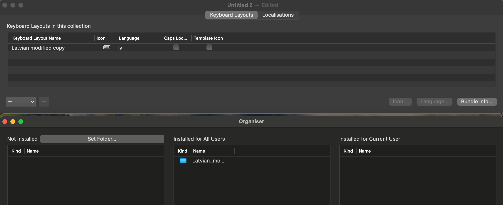

---

## Intro

[Ukelele](https://software.sil.org/ukelele/) is a free and open source software for creating and customizing keyboard layouts.

Really useful for people who use non-standard keyboard layouts, have specific characters in their language or use not a full size keyboards.

## How to create a custom layout from the existing one

1. Download Ukelele from [here](https://software.sil.org/ukelele/) and install it.
2. Open Ukelele and go to `File > New from current input source` and select the layout template you downloaded.
3. Double click on the layout, make changes and close the keyboard layout window.
4. Install the layout by going to `File > Install > Show organiser` and select the layout you created. Then drag and drop your layout from `Not installed` to `Installed for All Users` section.
5. Relogin or restart your computer for the changes to take effect.

## My custom layout

This is the layout I'm using for Latvian language and programming on a 65% keyboard. Extract and install the layout using the steps above.

[Download the layout](/files/Latvian_keyboard_modified.zip)
