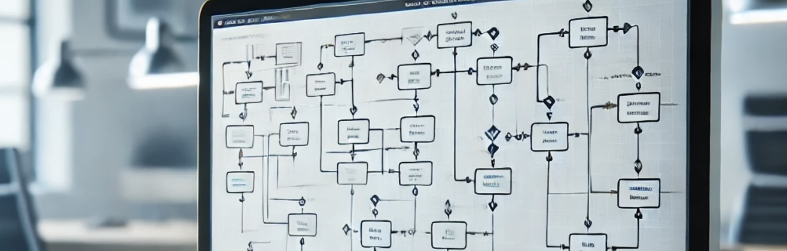

Using Nix and nix flakes to setup my workstation. Nix can be used both to
declaratively define system configuration and to install applications.

Nix can also manage per-project environment dependencies, which is really useful for
development flow.

This guide will cover the initial setup and some tips on how to manage the system configuration for an osx device. Different operating systems will have different setup, so this guide will cover only osx.

## Install Nix multi-user

```bash
sh <(curl -L https://nixos.org/nix/install)
```

## Initial setup

Clone the sample config from github.

```bash
git clone https://github.com/pcsssss/dotfiles-sample.git ~/Projects/dotfiles
```

This might take some time for the first run.

```bash
nix run  --extra-experimental-features flakes --extra-experimental-features nix-command nix-darwin -- switch --flake ~/Projects/dotfiles
```

## Apply changes to the system after changing the flake

```bash
darwin-rebuild switch --flake ~/Projects/dotfiles
```

## Sample nix system configuration

[This](https://github.com/pcsssss/dotfiles-sample) github repo contains an example nix configuration that can be used as a starting point.
